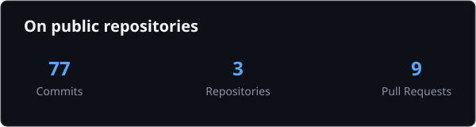

## Hi there 👋 I'm Kyohkotsu

🎓 Full-time Software Engineering Student  
🇯🇵 Part-time Japanese Language Teacher  
⚜️ Based in Montréal  
💻 Interested in systems programming, software engineering, automation and open source  
🐧 Linux user

---

## 💻 Programming Languages

---

## 🐧 Systems & Scripting

---

## 🛠️ Development Environment

---

## 🚧 What I'm Working On

- 🔐 Exploring low-level programming and algorithms
- 🦀 Learning Rust
- 🐧 Customizing Linux environments
- ⚙️ Automating everyday workflows with Python
- 🔄 Learning CI/CD and distributed systems

---

## 📊 GitHub Activity

  

